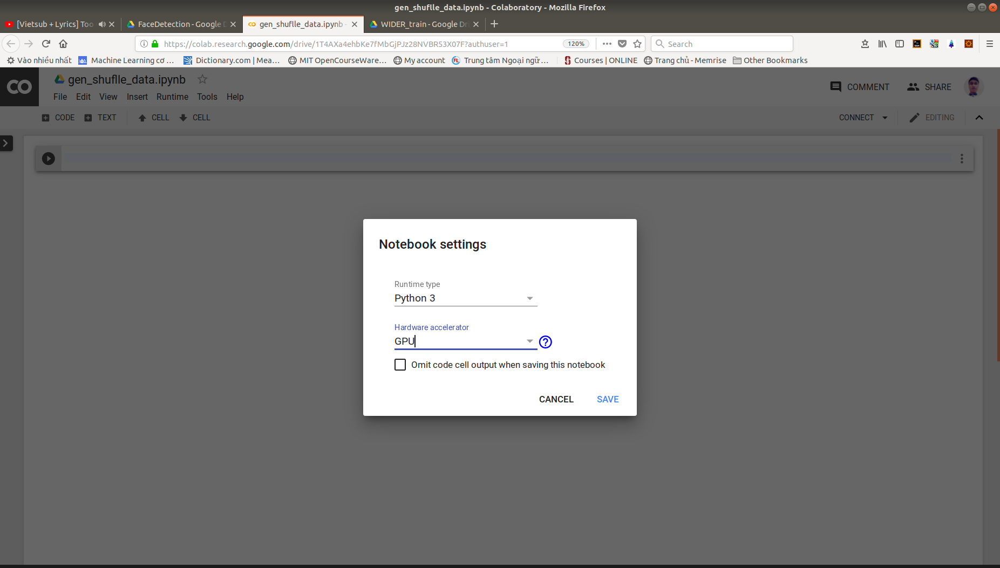
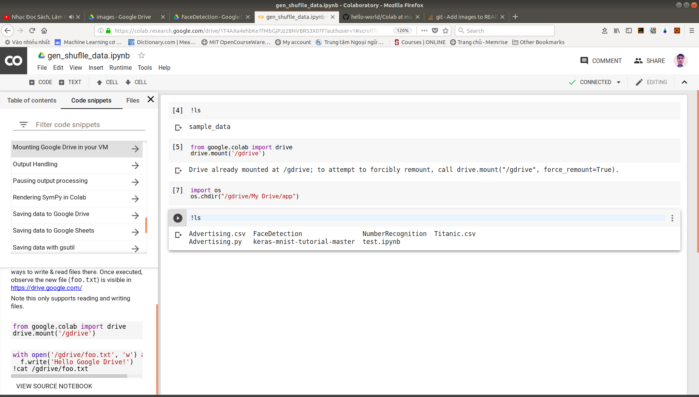
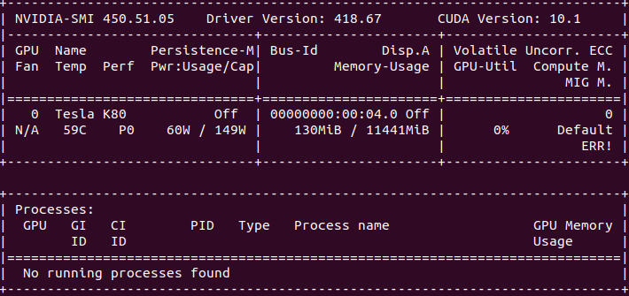

# Using colab GPU

## 1. Make **app** trong Driver
## 2. Make **Colaboratory** (right click) 
## 3. Set up 
edit > Notebook settings 

## 4. Xem docs
```bash
Ctrl + alt + p
```
or
insert > code snippet
## 5. Mount Driver
```bash
from google.colab import drive
drive.mount('/gdrive')
```
After that enter authorization by click URL go get password
## 6. cd 
```bash
import os
os.chdir("/gdrive/My Drive/app")
```


## 7. Extension Jypyter
[Jupyter Extension](https://towardsdatascience.com/bringing-the-best-out-of-jupyter-notebooks-for-data-science-f0871519ca29)
### Installation
```bash
conda install -c conda-forge jupyter_nbextensions_configurator
```
### Configurable
* Hinterland: giúp autocomplete
* Split Cells Notebook
* Table of contents
* Collapsiable Headings
* Autopep8
* Embedding URLs, PDFs
## 8. SSH access colab
```bash
# Install useful stuff
! apt install --yes ssh screen nano htop ranger git > /dev/null
# SSH setting
! echo "root:minhdeptroi" | chpasswd
! echo "PasswordAuthentication yes" > /etc/ssh/sshd_config
! echo "PermitUserEnvironment yes" >> /etc/ssh/sshd_config
! echo "PermitRootLogin yes" >> /etc/ssh/sshd_config
! service ssh restart > /dev/null
# Download ngrok
! wget -q -c -nc https://bin.equinox.io/c/4VmDzA7iaHb/ngrok-stable-linux-amd64.zip
! unzip -qq -n ngrok-stable-linux-amd64.zip
# Run ngrok
authtoken = "add Ngrok key ???"
get_ipython().system_raw('./ngrok authtoken $authtoken && ./ngrok tcp 22 &')
! sleep 3
# Get the address for SSH
import requests
from re import sub
r = requests.get('http://localhost:4040/api/tunnels')
str_ssh = r.json()['tunnels'][0]['public_url']
str_ssh = sub("tcp://", "", str_ssh)
str_ssh = sub(":", " -p ", str_ssh)
str_ssh = "ssh root@" + str_ssh
print(str_ssh)
```
### Access over ssh example
```bash
ssh root@0.tcp.ngrok.io -p 16664
```
### Added a config
```bash
echo /usr/lib64-nvidia/ > /etc/ld.so.conf.d/nvidia-lib64.conf
nvidia-smi
```

